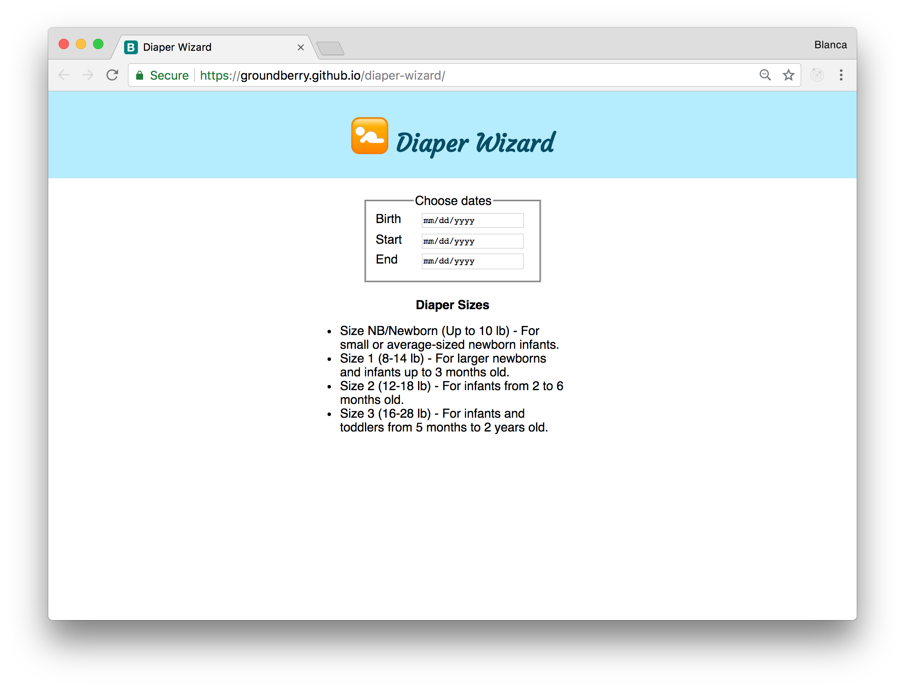
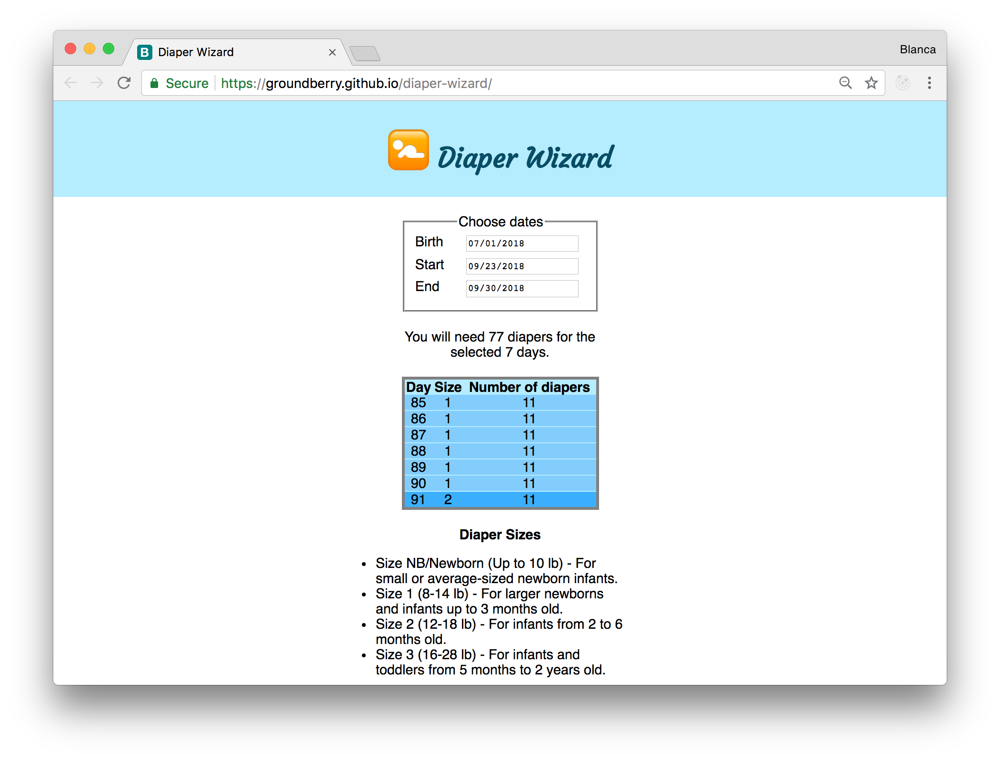
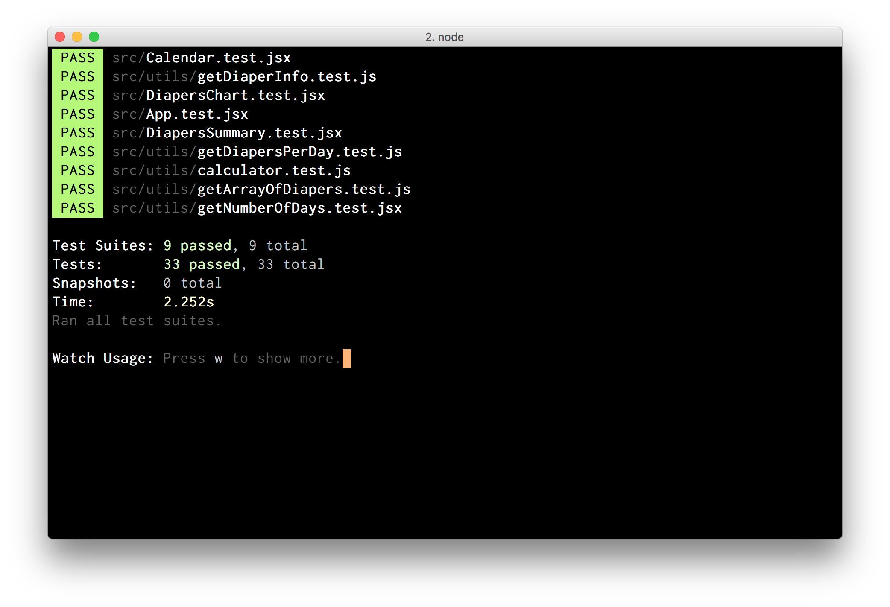

# Diaper Wizard

***Diaper Wizard*** is a tool for parents and expecting parents to plan the number of diapers needed for a certain period of their child's life. Babies use a different amount of diapers every day during the first days of life. After the first week the number stabilizes and we can estimate it based on age, and weight. This tool can make your life a bit easier when you need to plan ahead. We are using average values based on research. Just enter the birth date of your child, or another starting date, and choose a final date to calculate the amount of diapers you'll need for this period!

## Functionality

- As a user, I can choose a birth date from a calendar.
- As a user, I can choose a different starting date from a calendar.
- As a user, I can choose a final date from a calendar.
- As a user, I can know the amount of diapers needed for that period.
- As a user, I can see the amount of diapers needed for each day.
- As a user, I can know the size of the diapers needed for a period of time.




## Running the app

Clone this repo:

```
$ git clone https://github.com/groundberry/diaper-wizard
```

Install all dependancies:

```
$ npm install
```

Start the server:

```
$ npm start
```

And open the app in your browser at <http://localhost:3000/>.

## Testing the app

Run the tests:

```
$ npm run test
```

